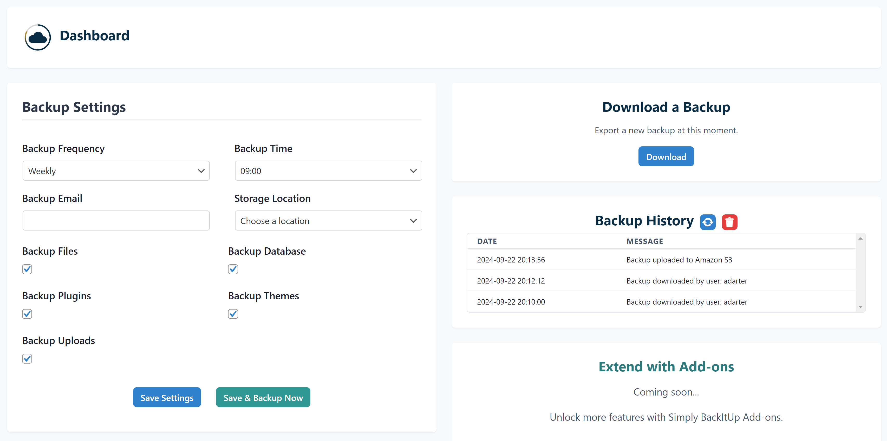

# Simply-BackItUp

In development do not use yet.

**Simply-BackItUp** is a WordPress plugin designed to simplify the process of backing up your website. Currently under development, this plugin aims to provide a user-friendly interface and powerful features to ensure your website's data is secure and easily restorable.

## Features

- **One-Click Backup:** Easily back up your entire WordPress site with just one click.
- **Scheduled Backups:** Schedule automatic backups to run at regular intervals.
- **Cloud Storage Integration:** Seamlessly back up your WordPress site to FTP servers or directly to AWS S3.
- **Restore with Ease:** Quickly restore your website from any backup.
- **Backup Management:** Manage and delete old backups to save space.
- **Email Notifications:** Receive email notifications on successful or failed backups.
- **Custom Backup Options:** Select specific files and databases to include in your backup.

## License

This project is licensed under the MIT License - see the [LICENSE](LICENSE) file for details.
